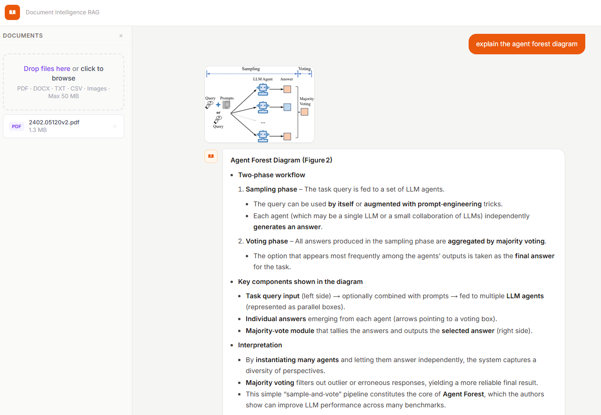
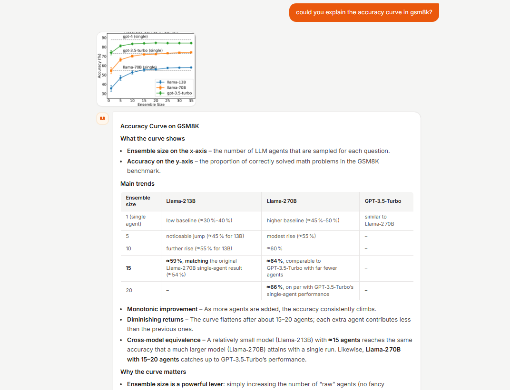

# Demo

Screenshots from a live session processing the research paper "More Agents Is All You Need" (2402.05120v2.pdf, 18 pages, 14 figures).

## Query 1: "explain the agent forest diagram"

The system correctly retrieves the Agent Forest flowchart (Figure 2, page 4) which shows the two-phase sampling-and-voting process.



**What happened:**
- Docling parsed the 18-page PDF, extracted 14 figures
- Each figure was captioned by Groq VLM (~1s for all 14 in parallel)
- Query decomposed into: `agent forest definition` | `agent forest algorithm` | `agent forest diagram`
- Retrieval found the flowchart chunk (page 4) via nomic embeddings
- BGE reranker scored it as #1 (0.67) — correctly identified as most relevant
- Image displayed inline with the answer

## Query 2: "could you explain the accuracy curve in gsm8k?"

The system retrieves Figure 1 (page 2) showing accuracy scaling with ensemble size across different LLMs on the GSM8K benchmark.



**What happened:**
- Same document, no re-processing needed
- Query decomposed into: `accuracy curve GSM8K` | `GSM8K benchmark results` | `ensemble size accuracy`
- Retrieval found Figure 1 chunk (page 2) with caption mentioning GSM8K and Llama2 models
- BGE reranker scored it at 0.97 — strong match
- LLM generated answer describing the accuracy trends from the VLM caption

## Pipeline Trace (Backend Log)

```
[ingest] 1 file(s) already in doc_index — skipping
[decompose] Model used: fallback1/openai/gpt-oss-120b
→ 3 sub-queries: agent forest definition | agent forest algorithm | agent forest diagram
[retrieve] 'agent forest diagram' → 5 chunks
[retrieve] 'agent forest algorithm' → 5 chunks
[retrieve] 'agent forest definition' → 5 chunks
[rerank] Best image: score=0.67 caption='The figure illustrates a process where multiple LLM...'
[rerank] 5 chunks reranked, 1 image(s) retrieved
[reflect] Context sufficient: yes
[generate] Model used: fallback1/openai/gpt-oss-120b
[stream] Graph complete. final_answer length: 1479
```

## Performance

| Stage | Time | Notes |
|-------|------|-------|
| Document upload (first time) | ~40s | Docling CUDA parsing + VLM captioning |
| Subsequent queries | ~15s | Skip ingestion, retrieval + LLM only |
| VLM captioning (14 images) | ~1.1s | Parallel via ThreadPoolExecutor |
| Embedding (51 chunks) | ~2s | nomic-embed-text-v1.5 on CUDA |
| Reranking (20 candidates) | ~0.3s | BGE cross-encoder on CUDA |

## Supported Documents

The system handles any document type that Docling supports:
- **PDFs** — Text extraction, OCR (if needed), table structure, figure extraction
- **DOCX** — Full text and structure extraction
- **CSV** — Tabular data parsing
- **Images** — Direct VLM analysis
- **TXT/Markdown** — Plain text processing

Multi-document sessions are supported — upload multiple files and query across all of them.
